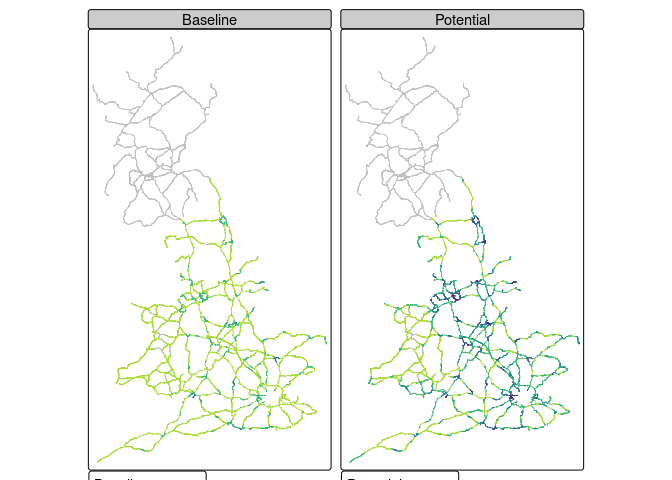
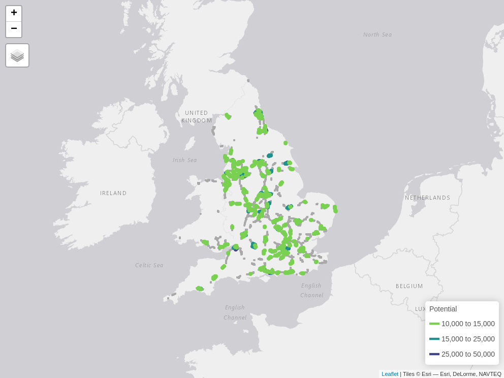
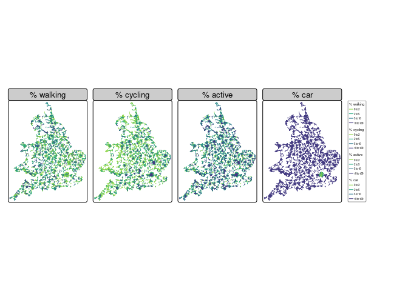
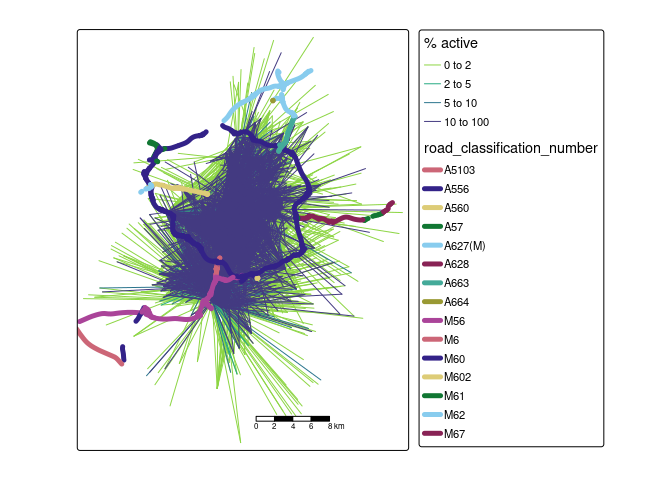

# Calculating active travel potential and severance around major transport infrastructure

Note: an interactive version of this report is available
[here](https://acteng.github.io/severance/severance.html).

This repo builds on work documented in the
[srn](https://github.com/acteng/srn) repo, focussing on active travel
potential and severance around major transport infrastructure.

# Input datasets

## Road network data

The Strategic Road Network (SRN) and Major Road Network (MRN) are
illustrated below (source: [browse tool of
ATIP](https://acteng.github.io/atip/browse.html?style=dataviz#6.2/52.917/-1.327)).

After downloading and combining the datasets, we can plot them as
follows with R:

The main focus of the analysis presented in this report is the SRN, the
road network controlled by National Highways (NH).

## Propensity to cycle tool

Data on active travel potential was taken from the Propensity to Cycle
Tool (PCT), a Department for Transport funded project that builds on
official data to model cycling potential nationwide. In future we would
like to add data representing walking potential, possibly based on
travel to school data.

# Active travel potential

As a first approximation of active travel potential we used Propensity
to Cycle Tool (PCT) data. To ensure consistency across areas, we defined
‘cycling potential’ in this case as the distance that could be cycled
*within* each grid cell, reducing the influence of variable road lengths
on the results (10 100 m segments with cycling potential of 20 has the
same impact as a single 5 km segment with cycling potential of 20 trips
per day). Aggregating to 5 km resolution ensures the operations work
fast for national data and remove noise from the results. Higher levels
of spatial resolution could be used in future work.

<!-- We'll convert the pct linestring data to a 5 km raster grid with the {terra} package. -->

<!-- We can subset all grids with high cycling potential (e.g. 5000 km cycling potential) and extract nearby roads to calculate severance as follows: -->

This approach allows identification of sections of the SRN and MRN in
areas with high (more than 5000 km cycled within each 5km grid cell
under the Go Dutch scenario) active travel potential nationwide, as
illustrated below.

<!-- Building on the simplistic approach, we'll assign active travel potential to each road segment based on the values of the 'active travel potential cells' that they intersect with. -->
<!-- This approach is illustrated below (a logical extension of this approach would be to use PCT section centroids as the basis for road active travel potential values): -->

The approach also allows estimation of current and potential future
levels of cycling *for every road segment*. The results of joining the
current estimated and potential cycling values to road segments, taking
the mean values of cell centroids that are within 5km of each road
segment centroid, are shown below.

Note: the units of the values presented above are in estimated km
cycling per day per 5 km grid cell, derived from the route network layer
in the PCT, representing active travel potential for utility cycling in
the vicinity of roads (estimated commuter cycling potential is a
function of number of cyclable trips to work and is a good proxy for
utility cycling potential and to a lesser extent leisure cycling
potential). We assign more meaningful units of estimated number of
potential trips in the next section.

After classifying the roads into named groups and keeping only road
sections with a level of cycling potential above a certain threshold
(2000 km cycled within each 5 km grid cell in the first instance), we
filtered out the top n. (e.g. 500) road sections based on cycling
potential. Roads were grouped in the following ways:

- by road classification number and name (if available)
- by active travel potential quantile (currently set to 20 quantiles
  although this can be varied to increase or decrease the number of
  groups and average length of road sections in each group)

In cases where the same road (e.g. M56) has multiple sections with high
cycling potential, the sections are given an id, e.g. M56 1, M56 2 etc.

In total, 1317 road sections at least 1km in length (another parameter
that can be adjusted) were identified with high cycling potential, with
the top 500 shown in the interactive table below.

The interactive map can be viewed by downloading resulting
[file](https://github.com/acteng/severance/releases/download/v1.0/m_top_srn.html)

and below:

# Desire lines approach

The results presented in the previous section are based on estimates of
active travel (commuter cycling) potential at the road network level in
the vicinity (around 5 km) of each road segment. This approach is good
for a ‘first pass’ national analysis but has limitations:

- There is no guarantee that the active travel on the segments in the
  vicinity of the roads need to interact with the roads, e.g. they could
  just run parallel to them.
- The approach leads to estimates of cycling potential in units that are
  not conducive to benefits estimation.
- The approach does not take into account the desire lines of cyclists,
  which may not follow the road network.

Using origin-destination data, which can be represented as ‘desire
lines’ between origin and destination points or zones, can address these
limitations.

The desire lines approach scales nationally although is more
computationally intensive than the road network approach. There are
1,408,275 desire lines in the national dataset from the PCT (compared
with 558,173 road segments). An overview of the desire lines, based on a
sample of the top 10,000 desire lines longer than 5km by current active
travel mode share, is shown below.

Because of the computational resources needed to process the national
desire lines dataset, we’ll focus on case study areas in this section.
The ~20k desire lines in the Manchester area are shown below.

<!-- # Outakes -->
<!-- ## Breaking-up SRN into small sections -->
<!-- ## Demo PCT modelling: -->
