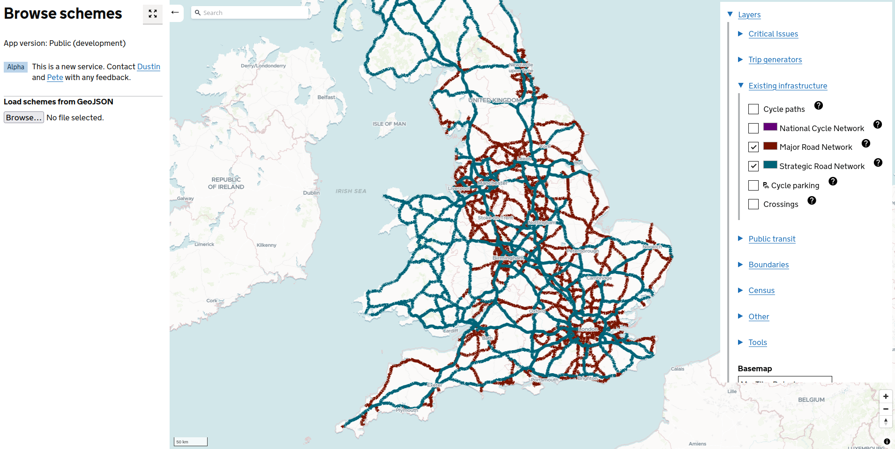
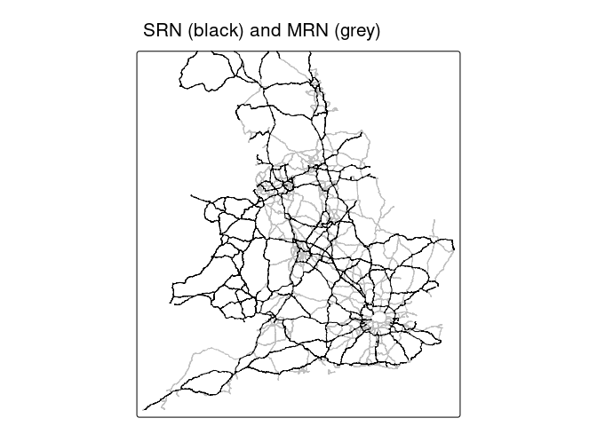
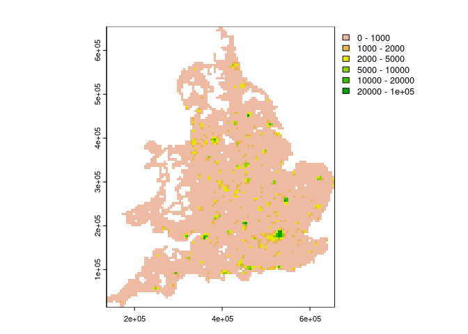
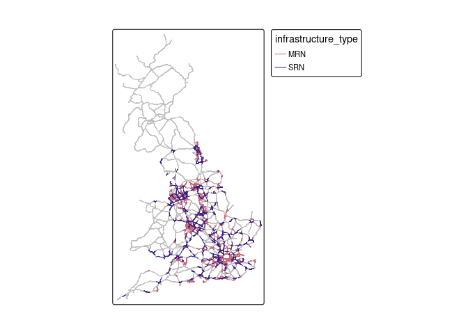

# Calculating active travel potential and severance around major
transport infrastructure


This repo builds on work documented in the
[srn](https://github.com/acteng/srn) repo, focussing on active travel
potential and severance around major transport infrastructure.

# Input datasets

## SRN and MRN

The Strategic Road Network (SRN) and Major Road Network (MRN) are
illustrated below (source: [browse tool of
ATIP](https://acteng.github.io/atip/browse.html?style=dataviz#6.2/52.917/-1.327)).



After downloading and combining the datasets, we can combine them and
plot them as follows with R:

``` r
mrn_srn = rbind(mrn, srn)
mrn_srn |>
  ggplot() +
  geom_sf(aes(color = infrastructure_type)) +
  theme_void()
```



# Active travel potential

As a first approximation of active travel potential, we’ll calculate
cycling potential from the Propensity to Cycle Tool (PCT) data. We’ll
aggregate to 1 km resolution so the operations work fast for national
data, as a starter for 10, and smooth the data to remove noise.

    Reading layer `pct' from data source 
      `/home/robin/github/acteng/severance/pct.gpkg' using driver `GPKG'
    Simple feature collection with 558173 features and 10 fields
    Geometry type: LINESTRING
    Dimension:     XY
    Bounding box:  xmin: 136416.3 ymin: 14073.94 xmax: 655158.9 ymax: 654381.8
    Projected CRS: OSGB36 / British National Grid

     [1] "local_id"            "bicycle"             "govtarget_slc"      
     [4] "govnearmkt_slc"      "gendereq_slc"        "dutch_slc"          
     [7] "ebike_slc"           "segment_length_km"   "cycling_km_baseline"
    [10] "cycling_km_go_dutch" "geom"               

We’ll convert the pct linestring data to a 1 km raster grid with the
{terra} package.

    terra 1.7.71

    WARNING: different compile-time and run-time versions of GEOS

    Compiled with:3.11.1-CAPI-1.17.1

     Running with:3.12.1-CAPI-1.18.1


    You should reinstall package 'terra'


    Attaching package: 'terra'

    The following object is masked from 'package:tidyr':

        extract

    Breaking News: tmap 3.x is retiring. Please test v4, e.g. with
    remotes::install_github('r-tmap/tmap')

    Warning: Values have found that are higher than the highest break

    Warning: Values have found that are higher than the highest break



We can subset all grids with high cycling potential (e.g. 5000 km
cycling potential) and extract nearby roads to calculate severance as
follows:

    Reading layer `pct_raster_sf' from data source 
      `/home/robin/github/acteng/severance/pct_raster_sf.gpkg' using driver `GPKG'
    Simple feature collection with 5671 features and 1 field
    Geometry type: POINT
    Dimension:     XY
    Bounding box:  xmin: 138912.2 ymin: 16572.62 xmax: 653912.2 ymax: 651572.6
    Projected CRS: OSGB36 / British National Grid

    Reading layer `mrn_srn_high' from data source 
      `/home/robin/github/acteng/severance/mrn_srn_high.gpkg' using driver `GPKG'
    Simple feature collection with 58782 features and 5 fields
    Geometry type: MULTILINESTRING
    Dimension:     XY
    Bounding box:  xmin: 163626.3 ymin: 40666.12 xmax: 655180 ymax: 588278
    Projected CRS: OSGB36 / British National Grid


